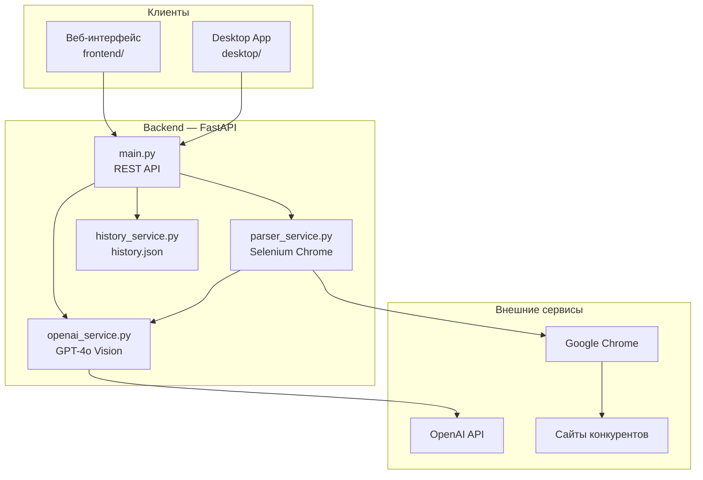

# Мониторинг конкурентов — AI Ассистент

MVP-приложение для анализа конкурентной среды с поддержкой мультимодальности: текст, изображения и автоматический парсинг сайтов через Selenium Chrome.


---

## Содержание

- [Описание](#описание)
- [Возможности](#возможности)
- [Архитектура](#архитектура)
- [Быстрый старт](#быстрый-старт)
- [Конфигурация](#конфигурация)
- [Структура проекта](#структура-проекта)
- [Функциональность](#функциональность)
- [API](#api)
- [Веб-интерфейс](#веб-интерфейс)
- [Десктопное приложение](#десктопное-приложение)
- [Технологии](#технологии)
- [Требования](#требования)
- [Устранение неполадок](#устранение-неполадок)
- [Документация](#документация)
- [Лицензия](#лицензия)

---

## Описание

**Мониторинг конкурентов** — это AI-ассистент для маркетологов, аналитиков и владельцев бизнеса. Приложение помогает быстро оценить конкурентов: проанализировать их тексты, визуальные материалы и сайты, получить структурированные выводы и практические рекомендации.

Проект состоит из трёх частей:

| Компонент | Описание |
|-----------|----------|
| **Backend** | FastAPI-сервер с интеграцией OpenAI и парсером на Selenium |
| **Frontend** | Веб-интерфейс на Vanilla JS с тёмной темой |
| **Desktop** | Нативное приложение на PyQt6 (опционально) |

---

## Возможности

- **Анализ текста** — структурированная аналитика с сильными/слабыми сторонами, УТП и рекомендациями
- **Анализ изображений** — баннеры, скриншоты сайтов, упаковка товаров с оценкой визуального стиля (0–10)
- **Парсинг сайтов** — автоматическое открытие страницы в Chrome, скриншот и извлечение всего контента для AI-анализа
- **История запросов** — последние 10 операций сохраняются в `history.json`

---

## Архитектура



### Поток парсинга сайта

```
URL → Selenium Chrome → загрузка страницы → скриншот + извлечение контента → OpenAI Vision API → анализ
```

При парсинге извлекаются:

- `title`, meta description, meta keywords
- заголовки H1–H3
- ссылки с текстом
- полный видимый текст страницы
- скриншот всей страницы (PNG)

Скриншот и текстовый контент передаются в Vision API для комплексного анализа.

---

## Быстрый старт

### 1. Клонирование и установка

```bash
# Перейдите в папку проекта
cd pem08-master

# Создайте виртуальное окружение
python -m venv venv

# Активируйте окружение
# Windows (PowerShell):
venv\Scripts\activate
# Linux / macOS:
source venv/bin/activate

# Установите зависимости
pip install -r requirements.txt
```

### 2. Настройка окружения

Создайте файл `.env` в корне проекта (шаблон — `env.example.txt`):

```env
OPENAI_API_KEY=your_openai_api_key_here
OPENAI_MODEL=gpt-4o-mini
OPENAI_VISION_MODEL=gpt-4o-mini
API_HOST=0.0.0.0
API_PORT=8000
```

Получить API-ключ: https://platform.openai.com/api-keys

### 3. Запуск

```bash
python run.py
```

После запуска приложение доступно по адресам:

| Ресурс | URL |
|--------|-----|
| Веб-интерфейс | http://localhost:8000 |
| Swagger UI | http://localhost:8000/docs |
| ReDoc | http://localhost:8000/redoc |
| Health check | http://localhost:8000/health |

Альтернативный запуск без `run.py`:

```bash
python -m uvicorn backend.main:app --reload --host 0.0.0.0 --port 8000
```

---

## Конфигурация

Все настройки задаются через `.env` или переменные окружения.

| Переменная | По умолчанию | Описание |
|------------|--------------|----------|
| `OPENAI_API_KEY` | — | API-ключ OpenAI (обязательно) |
| `OPENAI_MODEL` | `gpt-4o-mini` | Модель для анализа текста |
| `OPENAI_VISION_MODEL` | `gpt-4o-mini` | Модель для анализа изображений и сайтов |
| `API_HOST` | `0.0.0.0` | Хост сервера |
| `API_PORT` | `8000` | Порт сервера |

### Рекомендуемые модели OpenAI

| Модель | Назначение |
|--------|------------|
| `gpt-4o-mini` | Баланс цена/качество (по умолчанию) |
| `gpt-4o` | Максимальное качество анализа |
| `gpt-4-turbo` | Альтернатива для сложных задач |

### Настройки парсера (в `backend/config.py`)

| Параметр | Значение | Описание |
|----------|----------|----------|
| `parser_timeout` | `10` сек | Таймаут загрузки страницы |
| `parser_user_agent` | Chrome UA | User-Agent для Selenium |
| `max_history_items` | `10` | Максимум записей в истории |

---

## Структура проекта

```
pem08-master/
│
├── backend/                         # Backend-модуль
│   ├── main.py                      # FastAPI-приложение, эндпоинты
│   ├── config.py                    # Конфигурация и логирование
│   ├── models/
│   │   └── schemas.py               # Pydantic-схемы запросов/ответов
│   └── services/
│       ├── openai_service.py        # Интеграция с OpenAI API
│       ├── parser_service.py        # Парсинг через Selenium Chrome
│       └── history_service.py       # Управление историей
│
├── frontend/                        # Веб-интерфейс
│   ├── index.html                   # Главная страница
│   ├── styles.css                   # Стили (тёмная тема)
│   └── app.js                       # Логика UI и API-запросы
│
├── desktop/                         # Десктопное приложение (PyQt6)
│   ├── main.py                      # Главное окно
│   ├── api_client.py                # HTTP-клиент к backend
│   ├── styles.py                    # Тёмная тема
│   ├── build.py                     # Сборка .exe
│   └── requirements.txt             # Зависимости desktop
│
├── run.py                           # Скрипт запуска сервера
├── requirements.txt                 # Python-зависимости
├── env.example.txt                  # Пример .env
├── history.json                     # История запросов (создаётся автоматически)
├── docs.md                          # Подробная документация API
└── README.md                        # Этот файл
```

---

## Функциональность

### Анализ текста (`POST /analyze_text`)

Принимает текст конкурента (минимум 10 символов) и возвращает структурированный анализ:

- Сильные стороны
- Слабые стороны
- Уникальные предложения (УТП)
- Рекомендации по улучшению
- Краткое резюме

**Пример запроса:**

```bash
curl -X POST "http://localhost:8000/analyze_text" \
  -H "Content-Type: application/json" \
  -d '{"text": "Наша компания предлагает уникальные решения для бизнеса. Мы работаем на рынке 10 лет."}'
```

---

### Анализ изображений (`POST /analyze_image`)

Принимает изображение (PNG, JPG, GIF, WEBP) и возвращает:

- Описание изображения
- Маркетинговые инсайты
- Оценку визуального стиля (0–10)
- Анализ визуального стиля
- Рекомендации

**Пример запроса:**

```bash
curl -X POST "http://localhost:8000/analyze_image" \
  -F "file=@banner.png"
```

---

### Парсинг сайтов (`POST /parse_demo`)

Принимает URL сайта конкурента. Процесс:

1. Запуск headless Chrome через Selenium
2. Открытие страницы и ожидание загрузки
3. Создание скриншота всей страницы
4. Извлечение всего текстового контента
5. Передача скриншота и контента в OpenAI Vision API
6. Возврат структурированного анализа

**Пример запроса:**

```bash
curl -X POST "http://localhost:8000/parse_demo" \
  -H "Content-Type: application/json" \
  -d '{"url": "example.com"}'
```

**Пример ответа:**

```json
{
  "success": true,
  "data": {
    "url": "example.com",
    "title": "Example Domain",
    "h1": "Example Domain",
    "first_paragraph": "This domain is for use in illustrative examples...",
    "page_content": "Заголовок страницы (title): Example Domain\n\nПолный текст страницы:\n...",
    "analysis": {
      "strengths": ["..."],
      "weaknesses": ["..."],
      "unique_offers": ["..."],
      "recommendations": ["..."],
      "summary": "..."
    }
  }
}
```

Протокол `https://` добавляется автоматически, если не указан.

---

### История (`GET /history`, `DELETE /history`)

- Хранит последние 10 запросов в `history.json`
- Сохраняет тип запроса (`text`, `image`, `parse`), краткое описание и время
- Поддерживает очистку истории

```bash
# Получить историю
curl http://localhost:8000/history

# Очистить историю
curl -X DELETE http://localhost:8000/history
```

---

## API

### Эндпоинты

| Метод | Путь | Описание |
|-------|------|----------|
| `GET` | `/` | Веб-интерфейс |
| `POST` | `/analyze_text` | Анализ текста конкурента |
| `POST` | `/analyze_image` | Анализ изображения |
| `POST` | `/parse_demo` | Парсинг и анализ сайта |
| `GET` | `/history` | Получение истории |
| `DELETE` | `/history` | Очистка истории |
| `GET` | `/health` | Проверка работоспособности |
| `GET` | `/docs` | Swagger UI |
| `GET` | `/redoc` | ReDoc |

### Модели данных

**CompetitorAnalysis** (текст и парсинг):

```json
{
  "strengths": ["..."],
  "weaknesses": ["..."],
  "unique_offers": ["..."],
  "recommendations": ["..."],
  "summary": "..."
}
```

**ImageAnalysis** (изображения):

```json
{
  "description": "...",
  "marketing_insights": ["..."],
  "visual_style_score": 7,
  "visual_style_analysis": "...",
  "recommendations": ["..."]
}
```

Подробные примеры запросов и ответов — в [docs.md](docs.md).

---

## Веб-интерфейс

Веб-приложение доступно сразу после запуска сервера на http://localhost:8000.

### Вкладки

| Вкладка | Описание |
|---------|----------|
| **Анализ текста** | Вставьте текст конкурента и получите структурированный анализ |
| **Анализ изображений** | Загрузите изображение (drag & drop или выбор файла) |
| **Парсинг сайта** | Введите URL — приложение откроет страницу и проанализирует её |
| **История** | Просмотр последних 10 запросов |

### Особенности UI

- Тёмная тема с cyan-акцентами
- Боковая панель навигации
- Анимации загрузки
- Отображение результатов в структурированных блоках

---

## Десктопное приложение

В папке `desktop/` находится нативное приложение на **PyQt6**, повторяющее функционал веб-интерфейса.

### Установка и запуск

```bash
# 1. Запустите backend (в корне проекта)
python run.py

# 2. В отдельном терминале — desktop
cd desktop
pip install -r requirements.txt
python main.py
```

### Сборка .exe (Windows)

```bash
cd desktop
python build.py
```

Исполняемый файл появится в `desktop/dist/CompetitorMonitor.exe`.

> **Важно:** Desktop-приложение требует запущенный backend на `http://localhost:8000`. Backend не встроен в .exe.

Подробнее: [desktop/README.md](desktop/README.md)

---

## Технологии

| Категория | Стек |
|-----------|------|
| **Backend** | FastAPI, Python 3.9+, Uvicorn |
| **AI** | OpenAI API (GPT-4o-mini / GPT-4o) |
| **Парсинг** | Selenium 4, Chrome, webdriver-manager |
| **Валидация** | Pydantic 2, pydantic-settings |
| **Frontend** | HTML5, CSS3, Vanilla JavaScript |
| **Desktop** | PyQt6, PyInstaller |
| **Хранение** | JSON-файл (`history.json`) |

---

## Требования

### Обязательные

- **Python 3.9+**
- **OpenAI API-ключ** с доступом к GPT-4o-mini или GPT-4o
- **Интернет-соединение** для OpenAI API и парсинга сайтов

### Для парсинга сайтов

- **Google Chrome** — должен быть установлен в системе
- ChromeDriver устанавливается автоматически через `webdriver-manager`

### Опционально

- **PyQt6** — для десктопного приложения
- **PyInstaller** — для сборки .exe

---

## Устранение неполадок

### `OPENAI_API_KEY` не задан

При запуске `run.py` отображается `✗ НЕ ЗАДАН!`. Создайте файл `.env` с ключом API.

### Ошибки парсинга сайтов

| Ошибка | Причина | Решение |
|--------|---------|---------|
| `Не удалось найти сайт` | Неверный URL или DNS | Проверьте адрес сайта |
| `Превышено время ожидания` | Медленная загрузка | Увеличьте `parser_timeout` в `config.py` |
| `Ошибка браузера` | Chrome не установлен | Установите Google Chrome |
| WebDriver ошибка | Несовместимость версий | Обновите Chrome и зависимости |

### Chrome / ChromeDriver

```bash
pip install --upgrade selenium webdriver-manager
```

Убедитесь, что Google Chrome установлен и доступен в PATH.

### Порт 8000 занят

Измените порт в `.env`:

```env
API_PORT=8080
```

### CORS-ошибки

CORS настроен на `allow_origins=["*"]` — веб-интерфейс работает с того же origin. При внешнем фронтенде проверьте настройки в `backend/main.py`.

---

## Документация

| Ресурс | Описание |
|--------|----------|
| [docs.md](docs.md) | Подробная документация API с примерами |
| [desktop/README.md](desktop/README.md) | Десктопное приложение |
| http://localhost:8000/docs | Swagger UI (после запуска) |
| http://localhost:8000/redoc | ReDoc (после запуска) |

---

## Лицензия

MIT License
