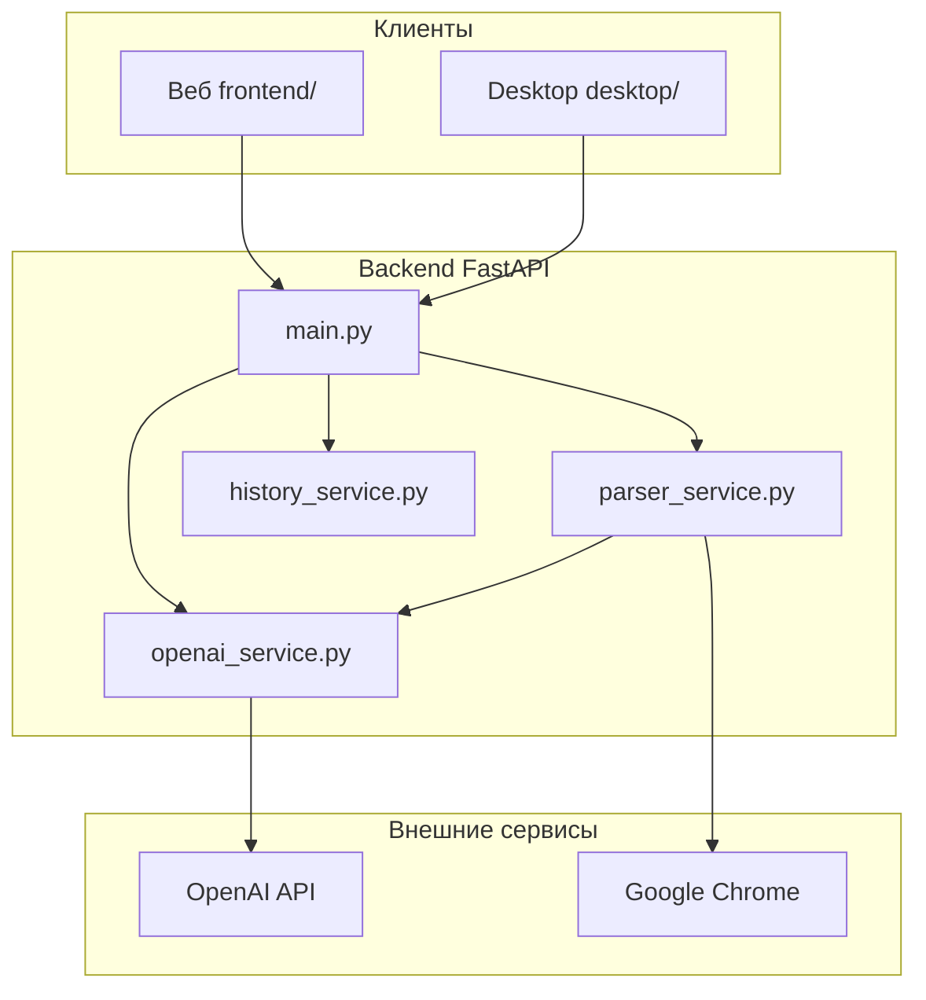

# Мониторинг конкурентов — AI Ассистент

AI-приложение для конкурентного анализа: тексты, изображения и сайты конкурентов превращаются в структурированный отчёт с оценками, инсайтами и рекомендациями.


---

## Содержание

- [Что умеет приложение](#что-умеет-приложение)
- [Быстрый старт](#быстрый-старт)
- [Конфигурация](#конфигурация)
- [Интерфейсы](#интерфейсы)
- [API](#api)
- [Архитектура](#архитектура)
- [Структура проекта](#структура-проекта)
- [Требования](#требования)
- [Устранение неполадок](#устранение-неполадок)
- [Документация](#документация)

---

## Что умеет приложение

| Режим | Вход | Результат |
|-------|------|-----------|
| **Анализ текста** | Текст с лендинга, рекламы, описания продукта | Сильные/слабые стороны, УТП, рекомендации, оценки |
| **Анализ изображений** | Баннер, скриншот, упаковка (PNG, JPG, GIF, WEBP) | Описание, маркетинговые инсайты, оценка дизайна |
| **Парсинг сайта** | URL конкурента | Selenium + скриншот + извлечение контента → AI-анализ |
| **История** | — | Последние 10 запросов в `history.json` |

### Метрики анализа

Помимо текстовых блоков, модель возвращает числовые оценки **0–10**:

| Поле | Анализ текста | Анализ изображений |
|------|---------------|-------------------|
| `design_score` | Структура, tone of voice, подача текста | Визуальный стиль: цвета, типографика, композиция |
| `animation_potential` | Пригодность для motion-рекламы и видео | Потенциал анимации элементов дизайна |
| `animation_potential_analysis` | Краткий разбор | Краткий разбор |

### Компоненты

```
Backend (FastAPI)  ←→  OpenAI API
       ↑
       ├── Веб-интерфейс (Vanilla JS)
       └── Desktop-приложение (PyQt6)
```

---

## Быстрый старт

### 1. Установка

```bash
cd pem08-master

python -m venv venv

# Windows (PowerShell)
venv\Scripts\activate

# Linux / macOS
source venv/bin/activate

pip install -r requirements.txt
```

### 2. Настройка `.env`

Скопируйте шаблон `env.example.txt` в `.env`:

```env
OPENAI_API_KEY=your_openai_api_key_here
OPENAI_MODEL=gpt-4o-mini
OPENAI_VISION_MODEL=gpt-4o-mini
API_HOST=0.0.0.0
API_PORT=8000
```

Ключ API: https://platform.openai.com/api-keys

### 3. Запуск сервера

```bash
python run.py
```

| Ресурс | URL |
|--------|-----|
| Веб-интерфейс | http://localhost:8000 |
| Swagger UI | http://localhost:8000/docs |
| ReDoc | http://localhost:8000/redoc |
| Health check | http://localhost:8000/health |

Альтернатива:

```bash
python -m uvicorn backend.main:app --reload --host 0.0.0.0 --port 8000
```

### 4. Desktop (опционально)

Backend должен быть запущен.

```bash
# Терминал 1 — backend
python run.py

# Терминал 2 — desktop
cd desktop
pip install -r requirements.txt
python main.py
```

---

## Конфигурация

### Переменные окружения

| Переменная | По умолчанию | Описание |
|------------|--------------|----------|
| `OPENAI_API_KEY` | — | API-ключ OpenAI **(обязательно)** |
| `OPENAI_MODEL` | `gpt-4o-mini` | Модель для текста |
| `OPENAI_VISION_MODEL` | `gpt-4o-mini` | Модель для изображений и сайтов |
| `API_HOST` | `0.0.0.0` | Хост сервера |
| `API_PORT` | `8000` | Порт сервера |

### Рекомендуемые модели

| Модель | Когда использовать |
|--------|-------------------|
| `gpt-4o-mini` | Баланс цена/качество (по умолчанию) |
| `gpt-4o` | Максимальное качество |
| `gpt-4-turbo` | Сложные задачи |

### Параметры парсера (`backend/config.py`)

| Параметр | Значение | Описание |
|----------|----------|----------|
| `parser_timeout` | `10` сек | Таймаут загрузки страницы |
| `parser_user_agent` | Chrome UA | User-Agent для Selenium |
| `max_history_items` | `10` | Лимит записей в истории |

---

## Интерфейсы

### Веб (`frontend/`)

Тёмная тема в **серых тонах**, боковая навигация, drag & drop для изображений.

| Вкладка | Действие |
|---------|----------|
| Анализ текста | Вставка текста → структурированный отчёт |
| Анализ изображений | Загрузка файла → визуальный и маркетинговый разбор |
| Парсинг сайта | URL → автоматический сбор и анализ страницы |
| История | Последние 10 запросов |

**Просмотр результатов** — полноэкранная панель с прокруткой, кнопка «Назад», закрытие по `Escape`.

### Desktop (`desktop/`)

PyQt6-клиент с тем же API. Результаты открываются на **весь экран** (форма скрывается), есть кнопки «← Назад» и «✕».

Сборка `.exe` (Windows):

```bash
cd desktop
python build.py
# → desktop/dist/CompetitorMonitor.exe
```

> Backend не встроен в `.exe` — сервер должен работать на `http://localhost:8000`.

Подробнее: [desktop/README.md](desktop/README.md)

---

## API

### Эндпоинты

| Метод | Путь | Описание |
|-------|------|----------|
| `GET` | `/` | Веб-интерфейс |
| `POST` | `/analyze_text` | Анализ текста |
| `POST` | `/analyze_image` | Анализ изображения (multipart) |
| `POST` | `/parse_demo` | Парсинг и анализ сайта |
| `GET` | `/history` | История запросов |
| `DELETE` | `/history` | Очистка истории |
| `GET` | `/health` | Проверка работоспособности |

### Примеры

**Анализ текста:**

```bash
curl -X POST "http://localhost:8000/analyze_text" \
  -H "Content-Type: application/json" \
  -d '{"text": "Наша компания работает на рынке 10 лет и обслуживает более 1000 клиентов."}'
```

**Анализ изображения:**

```bash
curl -X POST "http://localhost:8000/analyze_image" \
  -F "file=@banner.png"
```

**Парсинг сайта:**

```bash
curl -X POST "http://localhost:8000/parse_demo" \
  -H "Content-Type: application/json" \
  -d '{"url": "example.com"}'
```

Протокол `https://` добавляется автоматически, если не указан.

### Модели ответов

**CompetitorAnalysis** — текст и парсинг:

```json
{
  "strengths": ["..."],
  "weaknesses": ["..."],
  "unique_offers": ["..."],
  "recommendations": ["..."],
  "design_score": 7,
  "animation_potential": 6,
  "animation_potential_analysis": "...",
  "summary": "..."
}
```

**ImageAnalysis** — изображения:

```json
{
  "description": "...",
  "marketing_insights": ["..."],
  "design_score": 7,
  "visual_style_analysis": "...",
  "animation_potential": 8,
  "animation_potential_analysis": "...",
  "recommendations": ["..."]
}
```

Полные примеры запросов и ответов — в [docs.md](docs.md).

---

## Архитектура



### Парсинг сайта

```
URL → Selenium Chrome → скриншот + контент страницы → OpenAI Vision → CompetitorAnalysis
```

Извлекается: `title`, meta-теги, H1–H3, ссылки, полный видимый текст, PNG-скриншот.

---

## Структура проекта

```
pem08-master/
├── backend/
│   ├── main.py                 # FastAPI, эндпоинты, статика
│   ├── config.py               # Настройки и логирование
│   ├── models/schemas.py       # Pydantic-схемы
│   └── services/
│       ├── openai_service.py   # Промпты и вызовы OpenAI
│       ├── parser_service.py   # Selenium-парсер
│       └── history_service.py  # history.json
├── frontend/
│   ├── index.html
│   ├── styles.css              # Серая тёмная тема
│   └── app.js
├── desktop/
│   ├── main.py                 # PyQt6 UI
│   ├── api_client.py
│   ├── widgets.py              # ScoreBar, DropZone, ResultBlock
│   ├── styles.py
│   └── build.py                # PyInstaller
├── run.py                      # Точка входа
├── requirements.txt
├── env.example.txt
├── history.json                # Создаётся автоматически
├── docs.md                     # API-документация
└── README.md
```

---

## Требования

### Обязательно

- Python 3.9+
- OpenAI API-ключ (GPT-4o-mini или GPT-4o)
- Интернет

### Для парсинга сайтов

- Google Chrome (ChromeDriver ставится через `webdriver-manager`)

### Опционально

- PyQt6 — desktop-приложение
- PyInstaller — сборка `.exe`

---

## Устранение неполадок

| Проблема | Решение |
|----------|---------|
| `OPENAI_API_KEY` не задан | Создайте `.env` с ключом; при старте будет `✗ НЕ ЗАДАН!` |
| Порт 8000 занят | Укажите `API_PORT=8080` в `.env` |
| Ошибка парсинга / таймаут | Проверьте URL; увеличьте `parser_timeout` в `config.py` |
| Chrome / WebDriver | Установите Chrome; `pip install --upgrade selenium webdriver-manager` |
| Desktop не подключается | Убедитесь, что `python run.py` запущен на порту 8000 |

---

## Документация

| Ресурс | Описание |
|--------|----------|
| [docs.md](docs.md) | Подробная API-документация с примерами |
| [desktop/README.md](desktop/README.md) | Desktop-приложение |
| http://localhost:8000/docs | Swagger UI |
| http://localhost:8000/redoc | ReDoc |

---

## Лицензия

MIT License
